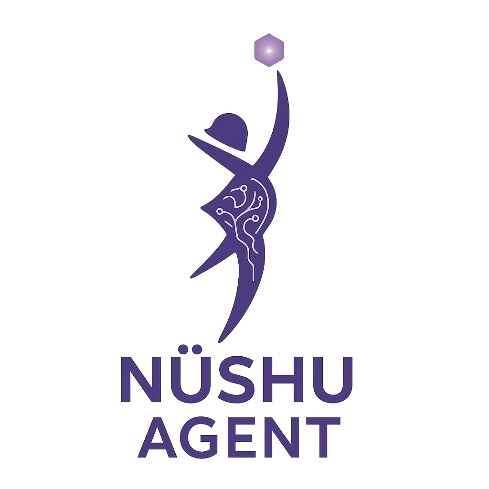
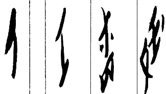
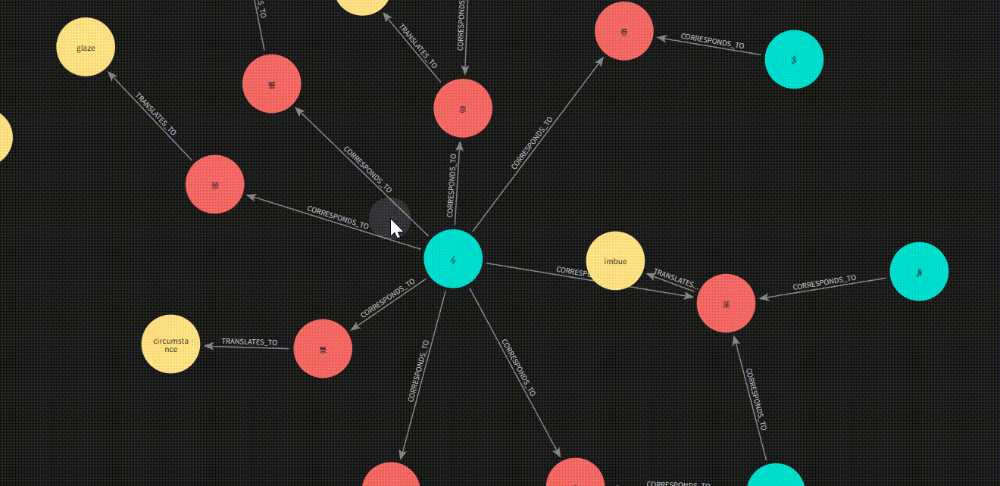
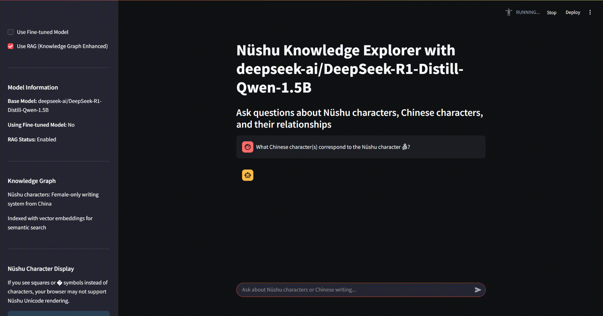
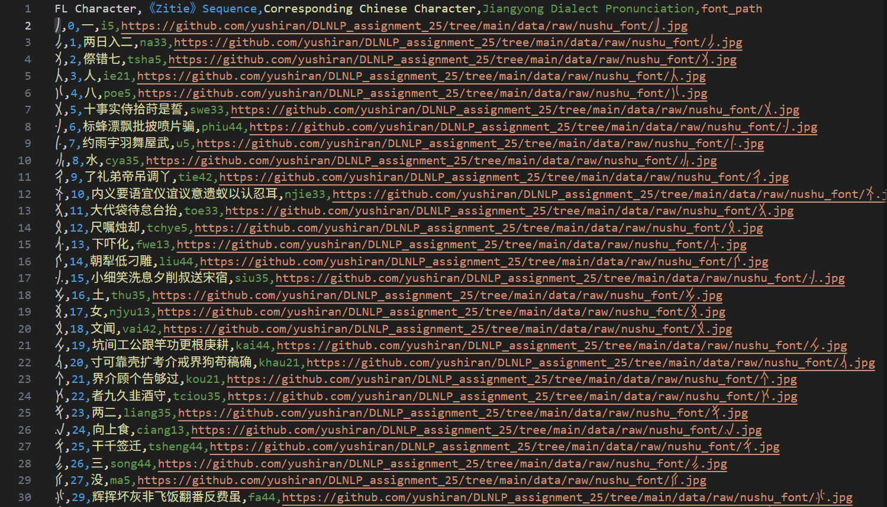
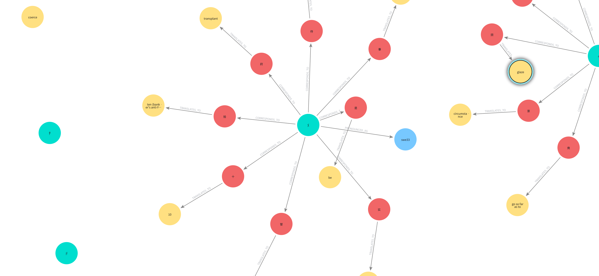
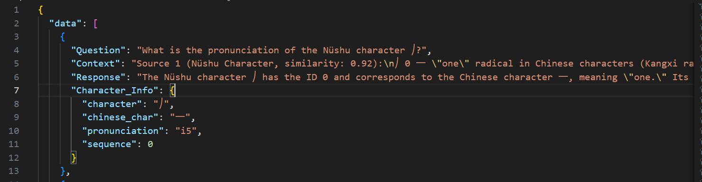
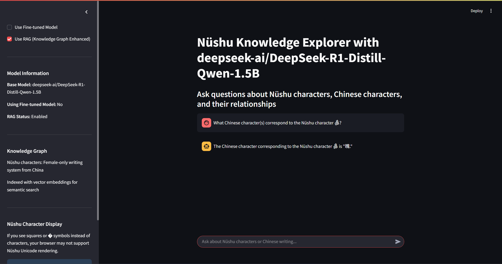

# DLNLP Assignment 25 - Nüshu Character Retrieval-Augmented Large Langurage Model Agent


[](https://huggingface.co/ShiranYu/nvshu_lora)


This repository contains a comprehensive system for Nüshu character recognition, analysis, and retrieval using advanced NLP techniques, knowledge graphs, and fine-tuned language models.

<!--  -->


## Table of Contents

- [Project Overview](#project-overview)
- [Project Structure](#project-structure)
- [Setting Up the Environment](#setting-up-the-environment)
- [Knowledge Graph Construction](#knowledge-graph-construction)
- [RAG System Implementation](#rag-system-implementation)
- [Model Fine-tuning](#model-fine-tuning)
- [Evaluation Results](#evaluation-results)

## Project Overview
This project implements a comprehensive system for analyzing and retrieving information about Nüshu characters (女书). Nushu (𛆁𛈬, 女书) is a mysterious script used exclusively among women in Jiangyong County of Southern China. It is handed down by mother to daughter among the Han and Yao people from generation to generation in Jiangyong County and its adjacent areas, becoming a unique cultural phenomenon in human history.Nushu characters are rhomboidal in shape, slim in style and imaginative in the form. The total amount of the characters being discovered is up to two thousand, all of which contain solely four kinds of strokes – dotted, vertical, oblique and arcuate.The system integrates advanced NLP techniques, knowledge graphs, and fine-tuned language models to provide accurate recognition, analysis, and retrieval of Nüshu characters. 



*This image depicts the term "Artificial Intelligence" written in Nüshu script.*

For more information about Nüshu, visit the [Nüshu Script Official Website](https://nushuscript.org/en-US/).
The dataset used in this project originates from the [](https://github.com/nushu-script/unicode_nushu.git), which provides raw Nüshu character data for analysis and processing.

1. **Knowledge Graph Database**: A Neo4j-based knowledge graph storing Nüshu characters and their relationships

2. **Retrieval-Augmented Generation (RAG)**: Using the DeepSeek and Qwen models with the knowledge graph

3. **LoRA Fine-tuned Models**: Specialized models for Nüshu character recognition and analysis



4. **Evaluation Framework**: Compare performance of different approaches

## Project Structure

```
DLNLP_assignment_25/
├── data/                           # Data files
│   ├── processed/                  # Processed data files
│   │   ├── data.csv                # Main processed dataset
│   │   ├── lora_dataset/           # Dataset for LoRA fine-tuning
│   │   │   └── nushu_lora_dataset.json
│   ├── raw/                        # Raw data files
│       └── nushu_font/             # Nüshu character images
├── evaluation_results/             # Evaluation metrics and results
├── latex/                          # LaTeX report files
├── logs/                           # Training and fine-tuning logs
├── model/                          # Model files and directories
│   ├── deepseek-ai/                # DeepSeek models
│   ├── google/                     # Google Gemma models
│   ├── meta-llama/                 # Llama 3.2 models
│   └── Qwen/                       # Qwen models
├── src/                            # Source code
│   ├── add_vector_index_to_kg.py   # Adding vector indices to knowledge graph
│   ├── create_knowledge_graph.py   # Knowledge graph creation
│   ├── deploy_rag_with_deepseek.py # RAG deployment with DeepSeek
│   ├── lora_finetune/              # LoRA fine-tuning scripts
│   │   ├── evaluate_finetuned_model.py
│   │   └── lora_finetune.py
│   └── utils/                      # Utility scripts
│       ├── add_font_toCSV.py       # Add font paths to CSV
│       ├── generate_lora_dataset.py # Generate dataset for LoRA
│       ├── gpt4o_search.py         # GPT-4o integration
│       ├── translator.py           # Translation utilities
│       └── unicode_helpers.py      # Unicode handling utilities
├── main.py                         # Main application entry point
├── pyproject.toml                  # Project configuration
└── uv.lock                         # UV dependency lock file
```

## Setting Up the Environment

This project uses `uv` for Python dependency management.

### Installing UV

If you don't have UV installed:

```bash
curl -sSf https://install.python-poetry.org | python3 -
```

### Setting up the Virtual Environment

```bash
# Create a new virtual environment
uv venv create

# Activate the virtual environment
source .venv/bin/activate

# Install dependencies
uv pip install -e .
```

### Environment Variables

Create a `.env` file with the following variables:
```
NEO4J_URI=bolt://localhost:7687
NEO4J_USERNAME=neo4j
NEO4J_PASSWORD=your_password
OPENAI_API_KEY=your_openai_api_key
AURA_INSTANCEID=
AURA_INSTANCENAME=
OPENAI_API_KEY=
OPENAI_BASE_URL=https://api.openai.com/v1
DEEPL_API_KEY=
```

## Knowledge Graph Construction

The Nüshu character knowledge graph is built using Neo4j:
### Setting Up Neo4j Service

Before constructing the knowledge graph, register for a cloud-based Neo4j service at [Neo4j Aura](https://neo4j.com/cloud/aura/) and obtain your connection credentials.

1. **Add Font Data to Knowledge Graph**:
    ```bash
    python src/utils/add_font_toCSV.py
    ```

As shown in data/raw/data.csv


2. **Knowledge Graph Creation**:
   ```bash
   python src/create_knowledge_graph.py
   ```


3. **Vector Index Addition**:
   ```bash
   python src/add_vector_index_to_kg.py
   ```
   

The knowledge graph structure includes:
- Nüshu character nodes
- Pronunciation relationships
- Meaning relationships
- Visual similarity connections
- Historical context

## Model Fine-tuning

### LoRA Dataset Generation

```bash
python -m src.utils.generate_lora_dataset
```

### Fine-tuning Models

The project includes LoRA fine-tuning for multiple models:

```bash
python -m src.lora_finetune.lora_finetune
```

Models fine-tuned include:
- DeepSeek-R1-Distill-Qwen-1.5B


### Evaluating Fine-tuned Models

```bash
python -m src.lora_finetune.evaluate_finetuned_model
```

Evaluation metrics include:
- Accuracy
- ROUGE scores
- Response quality and correctness

## Evaluation Results

Evaluation results are stored in the `evaluation_results/` directory:

- `metrics_summary.csv`: Summary of performance metrics
- `prediction_results.csv`: Detailed prediction results
- `metrics_comparison.png`: Visualization of model comparisons


## RAG System Implementation

The RAG (Retrieval Augmented Generation) system combines the Neo4j knowledge graph with the DeepSeek model:

1. **Start the RAG Interface**:
   ```bash
   streamlit run main.py
   ```

This launches a Streamlit interface that:
1. Accepts user queries about Nüshu characters
2. Retrieves relevant information from the knowledge graph
3. Augments the LLM's response with this contextual information
4. Returns comprehensive and accurate information about Nüshu characters

